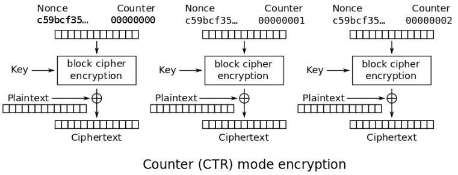

题目：实现CTR加密模式。

CTR是一种比较简单的加密模式，它可将块加密用作流加密，不需要padding。算法如下图示意。



本题目中给出的CTR加密与openssl等实现上略有差异。openssl中nonce为12字节，counter为4字节；而本题中nonce和counter分别为8字节，所以本题中的密文并不能使用openssl等命令来解密。

加密输入参数包括：
- key：密钥
- nonce：随机整数
- plain：明文

加密过程如下：对于明文的第i（0 <= i <= plain块的数量）个块数据plain[i]，首先将nonce和i组合成待加密的数据块nonce_counter，nonce_counter的前8字节是以小尾端存储的nonce值，后8字节是以小尾端存储的i；然后使用AES ECB模式加密nonce_counter，得到nonce_counter_cipher，最后使用nonce_counter_cipher和plain[i]异或，得到第i个密文块cipher[i]。如果最后一个块plain[j]的大小k不足一整块，则只取密文cipher[j]的前k字节即可。

代码：
```
def AES-CTR-ENC(key, nonce, plain):
    plain_size = len(plain)
    nonce_bytes = nonce.to_byte(8, "little")
    blocks, remainds = divmod(plain_size)
    cipher = b""
    for i in range(blocks):
        nonce_counter = nonce_bytes + i.to_bytes(8, "little")
        nonce_counter_cipher = AES-CBC(key, nonce_counter)
        cipher += xor(nonce_counter_cipher, plain[i*16:(i+1)*16])
    if remainds:
        nonce_counter = nonce_bytes + blocks.to_bytes(8, "little")
        nonce_counter_cipher = AES-CBC(key, nonce_counter)
        cipher += xor(nonce_counter_cipher[:remainds], plain[blocks*16:])
    return cipher
```

解密是加密的逆过程，参考代码。